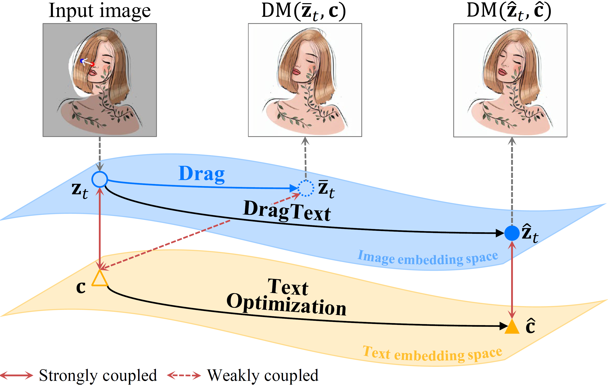


Hi! I'm Gayoon Choi and currently pursuing my M.S. degree at Yonsei University, advised by Prof. [Seong Jae Hwang](https://micv.yonsei.ac.kr/seongjae). My research interests include Image Editing, Parameter-Efficient Fine Tuning, and Test-Time Adaptation.


## News :tada:
<ul style="line-height: 1.2;" align="left">
    <li>[Aug 2024] One Paper <strong>EARLY ACCEPTED</strong> for <a href="https://wacv2025.thecvf.com/" target="_blank">WACV 2025</a></li>
    <li>[May 2024] One Paper Accepted for <a href="https://conferences.miccai.org/2024/en/" target="_blank">MICCAI 2024</a></li>
    <li>[Sep 2023] Join <a href="https://micv.yonsei.ac.kr/" target="_blank">MICV Lab</a> in <a href="https://www.yonsei.ac.kr"  target="_blank">Yonsei Univeristy</a> for M.S. Degree</li>
</ul>

## Publications

    

        
        

            

                DragText: Rethinking Text Embedding in Point-based Image Editing
            

            

                <strong>Gayoon Choi</strong>, Taejin Jeong, Sujung Hong, Seong Jae Hwang
            

            

                WACV 2025
            

            

                <a href="" style="text-decoration: none;">
                    Paper
                </a>
                <a href="https://arxiv.org/abs/2407.17843" style="text-decoration: none;">
                    arXiv
                </a>
                <a href="https://github.com/MICV-yonsei/DragText" style="text-decoration: none;">
                    Code
                </a>
                <a href="https://micv-yonsei.github.io/dragtext2025/" style="text-decoration: none;">
                    Project Page
                </a>
            

        

    

    

        
        

            

                Parameter Efficient Fine Tuning for Multi-scanner PET to PET Reconstruction
            

            

                Yumin Kim*, <strong>Gayoon Choi</strong>*, Seong Jae Hwang
            

            

                MICCAI 2024
            

            

                <a href="" style="text-decoration: none;">
                    Paper
                </a>
                <a href="https://arxiv.org/abs/2407.07517" style="text-decoration: none;">
                    arXiv
                </a>
                <a href="https://github.com/MICV-yonsei/PETITE" style="text-decoration: none;">
                    Code
                </a>
                <a href="https://micv-yonsei.github.io/petite2024/" style="text-decoration: none;">
                    Project Page
                </a>
            

        

    

