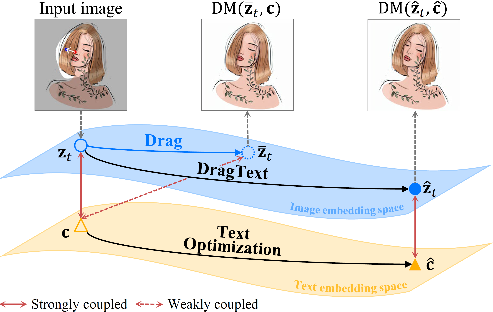
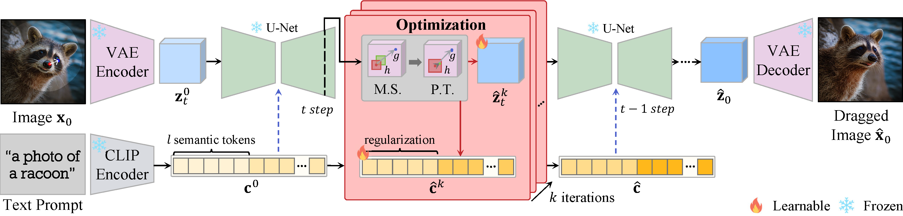


We propose DragText, which optimizes text embedding in conjunction with the dragging process to pair with the modified image embedding.


## Abstract
Point-based image editing enables accurate and flexible control through content dragging. However, the role of text embedding in the editing process has not been thoroughly investigated. A significant aspect that remains unexplored is the interaction between text and image embeddings. 

In this study, we show that during the progressive editing of an input image in a diffusion model, the text embedding remains constant. As the image embedding increasingly diverges from its initial state, the discrepancy between the image and text embeddings presents a significant challenge. Moreover, we found that the text prompt significantly influences the dragging process, particularly in maintaining content integrity and achieving the desired manipulation. 

To utilize these insights, we propose DragText, which optimizes text embedding in conjunction with the dragging process to pair with the modified image embedding. Simultaneously, we regularize the text optimization process to preserve the integrity of the original text prompt. Our approach can be seamlessly integrated with existing diffusion-based drag methods with only a few lines of code.

## Method

During the edit, the original image embedding \\( \mathbb{z}_t \\) naturally deviates to the dragged image latent vector \\( \bar{\mathbb{z}}_t \\). With no text optimization, the corresponding text embedding \\( c \\) is decoupled from \\( \bar{\mathbb{z}}_t \\). Hence, optimal text embedding \\(\hat{c} \\)coupled with dragged images has to be acquired to make the optimal latent vector \\( \hat{\mathbb{z}}_t \\)which then holds the related semantics via text.  

In DragText, the image \\(\mathbf{x}_0\\) is mapped to a low-dimensional space through a VAE encoder, and the text is encoded by a CLIP text encoder as the text embedding \\( c \\). Through DDIM inversion with \\( c \\), the latent vector \\( \mathbb{z}_t \\) is obtained. At time step \\(t=35\\), \\( \mathbb{z}_t^0 \\) and \\( c \\) are optimized to \\( \hat{\mathbb{z}}_t^k \\) and \\(\hat{c} \\) by iterating with motion supervision (M.S.) and point tracking (P.T.) \\(k\\)-times.
