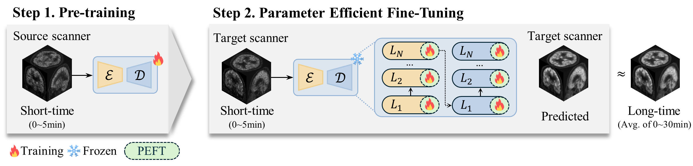
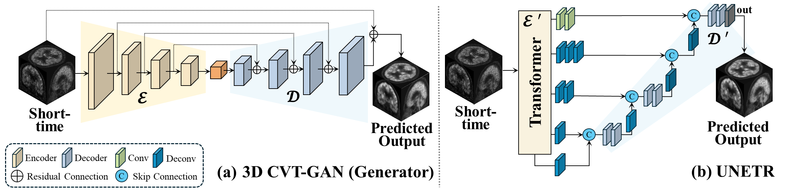
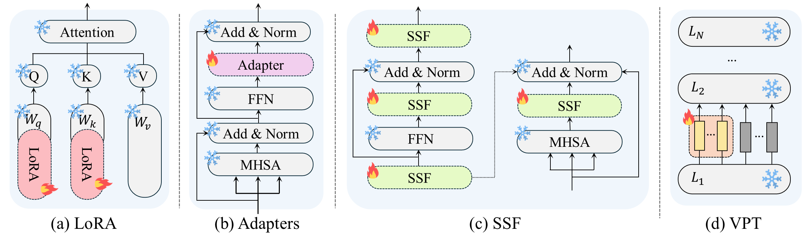


We introduce PETITE, <b>P</b>arameter-<b>E</b>fficient Fine-<b>T</b>uning for Mult<b>I</b>-scanner PE<b>T</b> to PET R<b>E</b>construction which represents the optimal PEFT combination when independently applying encoder-decoder components to each model architecture.


## Abstract
Reducing scan time in Positron Emission Tomography (PET) imaging while maintaining high-quality images is crucial for minimizing patient discomfort and radiation exposure. Due to the limited size of datasets and distribution discrepancy across scanners in medical imaging, fine-tuning in a parameter-efficient and effective manner is on the rise. 

Motivated by the potential of Parameter-Efficient Fine-Tuning (PEFT), we aim to address these issues by effectively leveraging PEFT to improve limited data and GPU resource issues in multi-scanner setups. In this paper, we introduce PETITE, Parameter-Efficient Fine-Tuning for MultI-scanner PET to PET REconstruction which represents the optimal PEFT combination when independently applying encoder-decoder components to each model architecture. 

To the best of our knowledge, this study is the first to systematically explore the efficacy of diverse PEFT techniques in medical imaging reconstruction tasks via prevalent encoder-decoder models. This investigation, in particular, brings intriguing insights into PETITE as we show further improvements by treating encoder and decoder separately and mixing different PEFT methods, namely, Mix-PEFT. 

Using multi-scanner PET datasets comprised of five different scanners, we extensively test the cross-scanner PET scan time reduction performances (i.e., a model pre-trained on one scanner is fine-tuned on a different scanner) of 21 feasible Mix-PEFT combinations to derive optimal PETITE. We show that training with less than 1% parameters using PETITE performs on par with full fine-tuning (i.e., 100% parameter).

## Method

The overview of PETITE: Scheme for single source-target settings in PET scan time reduction with PEFT. We leverage the PEFT methodology in a medical reconstruction task to reduce the scan time of PET images on scanners with different dimensions, voxel spacing, and institutions. To the best of our knowledge, this extensive study represents the first application of the PEFT methodology within the field of medical imaging.

The pipeline of the encoder-decoder structure of each ViT-based model. (a) 3D CVT-GAN features a generator with a ViT-based encoder and decoder. Only the first three layers of the encoder and the first two layers of the decoder are trained. (b) UNETR consists of a ViT-based encoder and a CNN-based decoder. The optimal PEFT combination independently applying encoder-decoder components to each model architecture.

We provide novel insights into the optimal PEFT settings tailored for the reconstruction model. Upon experimenting with possible Mix-PEFT, we found that using less than 1% of parameters can achieve performance comparable to Full-FT, carefully considering encoder and decoder architecture.